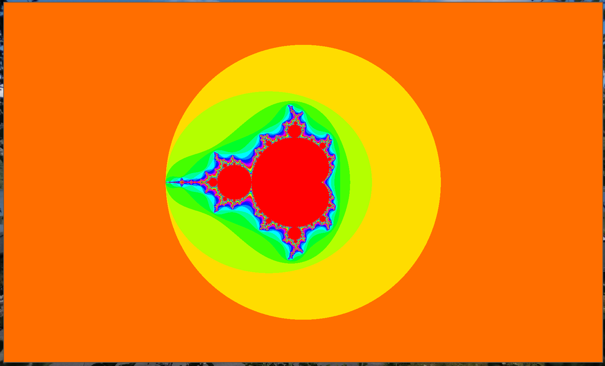

# HardWare accelerated Fractals

There are currently two branches, C and C++. Why, I wanted to compare what it
feels like writing the program in C and in C++. Currently only C++ is
implemented.

## Quick start
Look at the C or C++ branch to get started.

## License
Free as in Freedom. [GPL-3.0-or-later](./LICENSE)
